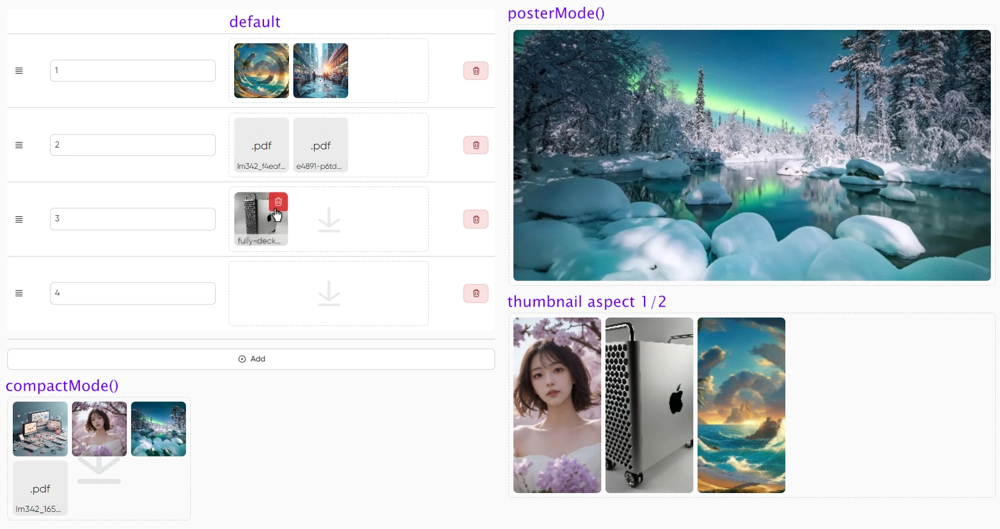

# MoonShine Dropzone

### CURRENTLY IN EARLY DEVELOPMENT STATE

**Dropzone.js** integration for the [MoonShine](https://github.com/moonshine-software/moonshine) admin panel.

Based on the fork
https://github.com/NicolasCARPi/dropzone
of the original 
https://github.com/dropzone/dropzone



**Description:**
- Minimalistic drag‑and‑drop or click-to-choose area.
- Uploads immediately on file drop (may become an option in the future).
- Thumbnail generation for the basic image files.
- Simple text icon for the unsupported formats.
- File removal confirmation.
- Tries uploading rejected files (e.g. when we remove something and go below max files limit ). Currently only on Remove event.
- Currently not actually deleting files on the server.

---

## Installation

```bash
composer require moonshine/dropzone
```

Registers Route /moonshine-dropzone

```bash
php artisan vendor:publish --tag=moonshine-dropzone-assets
```

---

## Usage

- Set column as JSON in Model $casts.
- Add a field in your MoonShine resource:
- Saves a String in maxFiles( 1 ) mode and Array in multiple files mode.

**Basic example**
```php
use MoonShine\Dropzone\Fields\Dropzone;

Dropzone::make( 'Images', 'images' )
	->uploadTo( '', '/project_name/images' ) 
	->maxFiles( 6 )
```

**More options**


## 📄 License

MIT – see `LICENSE` file.

---