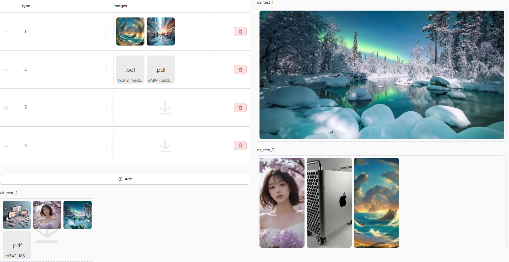

# MoonShine Dropzone

**Dropzone.js** integration for the [MoonShine](https://github.com/moonshine-software/moonshine) admin panel.

Based on the fork
https://github.com/NicolasCARPi/dropzone
of the original 
https://github.com/dropzone/dropzone



**Description:**
- minimalistic drag‑and‑drop or click-to-choose area
- uploads immediately on file drop (may become an option in the future)
- thumbnail generation for the basic image files
- simple text icon for the unsupported formats
- file removal confirmation
- tries uploading rejected files (e.g. when we remove something and go below max files limit ). Currently only on Remove event.
- currently not actually deleting files on the server

---

## Installation

```bash
composer require moonshine/dropzone
```

Registers Route /moonshine-dropzone

```bash
php artisan vendor:publish --tag=moonshine-dropzone-assets
```

> The assets are published to `public/vendor/moonshine-dropzone`.

---

## Usage

- Add column to Model $casts as JSON.
- Add a field in your MoonShine resource:

```php
use MoonShine\Dropzone\Fields\Dropzone;

Dropzone::make( 'Images' )
	->uploadTo( '/storage/', 'project_name' ) 
	->maxFiles( 10 )
	->layout( 'grid' ) 
	->thumbnail( 200, 100, '4/3' )
	->note('Maximum 10 images. Drag & drop to upload.');
```


## 📄 License

MIT – see `LICENSE` file.

---